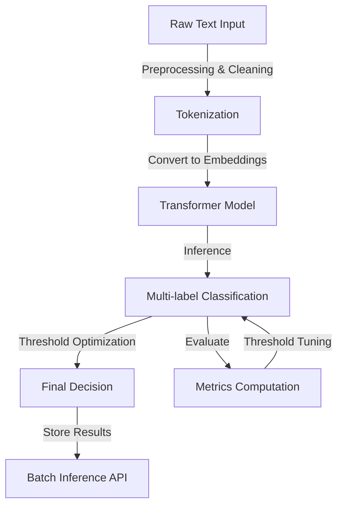

# Lexi-Phylax: Hate Speech Classification Engine

Lexi-Phylax is an advanced **multi-label hate speech classification engine** designed for **accurate and scalable content moderation**. It initially leveraged a **BERT-based transformer model from Hugging Face**, fine-tuned on a custom dataset.

## System Architecture



## Features
- **Transformer-based multi-label classification:** Detects multiple hate speech categories within a single input.
- **Fine-tuned BERT:** Fine-tuned the pre-trained **BERT** model on a custom dataset of hate-speech with labels, doing a full fine-tuning of the model.
- **Optimized Training Pipeline:** Includes **gradient checkpointing, mixed-precision FP16 training, and weighted loss** for class imbalance.
- **Threshold Optimization:** Automatic **F1-maximizing threshold tuning per label**.
- **High-performance Inference:** Supports **batch inference** for large-scale processing.

## Training Instructions

To train the model, run:

```bash
python main.py \
    --train_csv /path/to/train.csv \
    --valid_csv /path/to/valid.csv \
    --output_dir ./multi_label_ckpt \
    --epochs 3 \
    --batch_size 4 \
    --lr 2e-5 \
    --max_length 256 \
    --sample_checkpoint_interval 10000 \
    --fp16 True \
    --gradient_checkpointing True \
    --run_inference False \
    --class_weights True \
    --early_stopping_patience 2 \
    --tune_thresholds True
```

- Training **automatically resumes from the last checkpoint** if interrupted.
- **Threshold tuning** (`--tune_thresholds True`) finds the best decision thresholds for improved classification accuracy.

## Multi-GPU Training

For distributed training across multiple GPUs:

```bash
torchrun --nproc_per_node=4 main.py ...
```

## Batch Inference

Once trained, batch inference can be run as follows:

```python
from model_inference import run_inference_in_batches

texts = ["This is an example hate speech.", "Neutral statement."]
model_path = "./multi_label_ckpt"

predictions = run_inference_in_batches(model_path, texts, batch_size=8)
print(predictions)
```

## Technologies Used
- **Transformers (Hugging Face)**
- **PyTorch**
- **FastText (for embedding experiments)**
- **Scikit-learn**
- **Matplotlib & Seaborn (for visualization)**
- **Kaggle datasets**

## Ongoing Enhancements
- **Optimizing inference speed and computational efficiency** for real-time moderation.
- **Improving context-aware classification** to capture nuanced hate speech patterns.

---

This repository provides the code for **training, evaluating, and deploying** the Lexi-Phylax hate speech classification engine. Datasets are not uploaded here!
